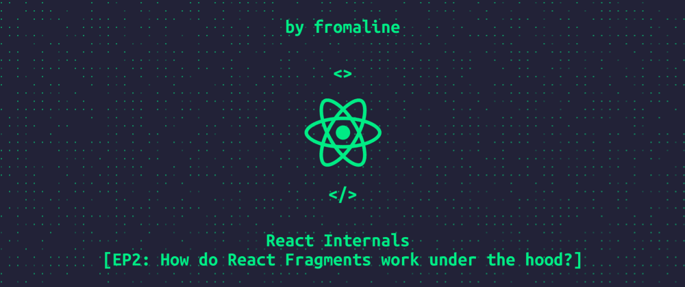

# Assignment 4
## Is JSX Mandatory For React?
No

## Is ES6 Required For React? 
No

## What is React Fragment?

## How do React Fragments work under the hood?

### 👉 React Fragment is just a React Element of a special type!
JSX is a syntax sugar for calling React.createElement
This function expects only three possible groups of types:

* Tag name for basic HTML elements
* Class/function for user-defined components
* React fragment type

<pre>
<code>

// what you write
const Items = () => {
  return (
    <>
      <li>First element</li>
      <li>Second element</li>
      <li>Third element</li>
    < />
  );
}

// what React gets after babel transpilation
const Items = () => {
  return React.createElement(
    React.Fragment, 
    null,
    React.createElement("li", null, "First element"),
    React.createElement("li", null, "Second element"),
    React.createElement("li", null, "Third element")
  );
};

</code>
</pre>

### 👉 How does React work with fragments?
After all, there are no corresponding DOM elements!

React doesn't need real DOM elements to deal with fragments.
It forms a virtual DOM instead 💡

<pre>
<code>
// Items() return this
{
  "type": Symbol(react.fragment),
  "key": null,
  "ref": null,
  "props": {
    "children": [
      {
        "type": "li",
        "key": null,
        "ref": null,
        "props": {
          "children": "First element"
        },
      },
      // ...
    ]
  }
}

</code>
</pre>

ReactDOM, in turn, ignores fragments and renders all children without any wrappers.

## What is React Fiber?

React Fiber is an internal engine change geared to make React faster and smarter. The Fiber reconciler, which became the default reconciler for React 16 and above, is a complete rewrite of React’s reconciliation algorithm to solve some long-standing issues in React.
