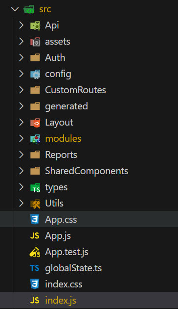

# Folder Structure In React

There are no hard and fast rule for folder structure in react.
we can put our files in any way.

but there are some common approaches for file structure
* grouping by feature/ module
* grouping by file types
* Don't nest too much deep ( relative import )

# Folder structure in WP

