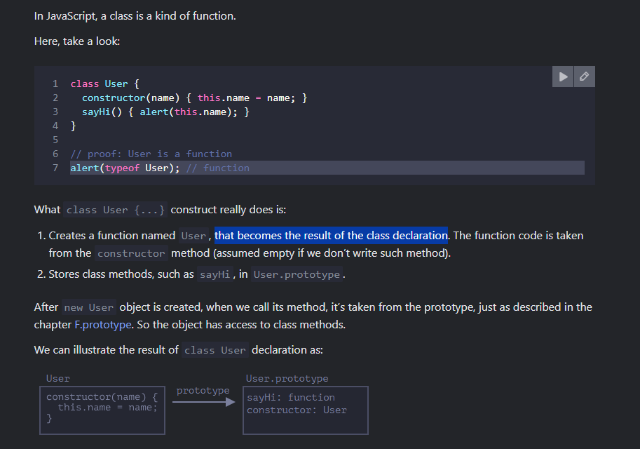
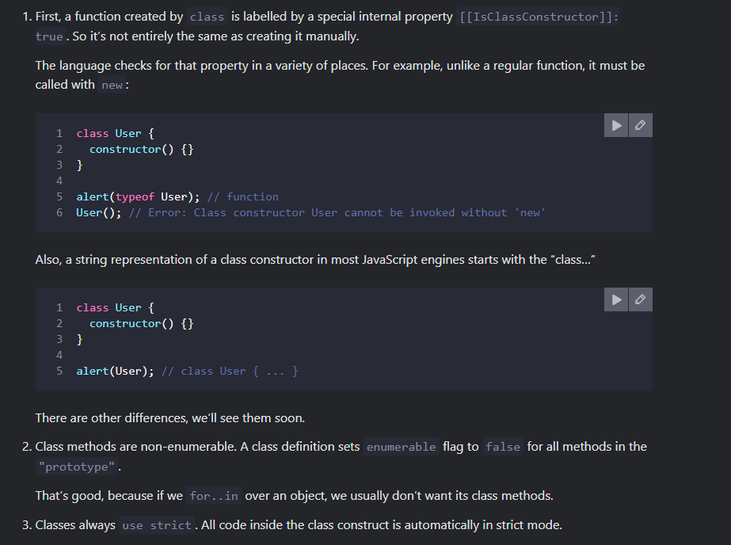
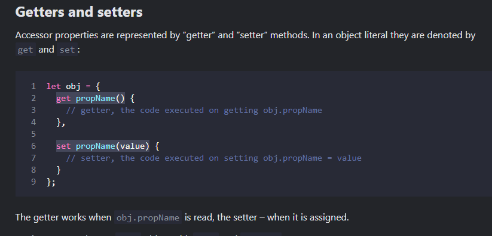

# Classes

In oops, class is basically a template for creating objects.

## Q1. What is class?

## Q2. Is Class just a syntactic sugar in Js?
No, 

## Q3. What is getter & Setter?
There are two kinds of object properties.

* The first kind is data properties. We already know how to work with them. All properties that we’ve been using until now were data properties.

* The second type of property is something new. It’s an accessor property. They are essentially functions that execute on getting and setting a value, but look like regular properties to an external code.

## Intro - Classes in Javascript
