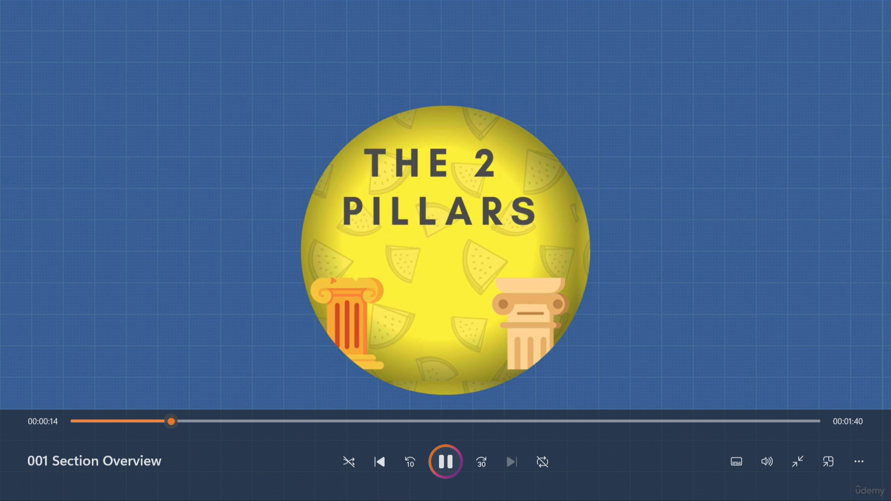
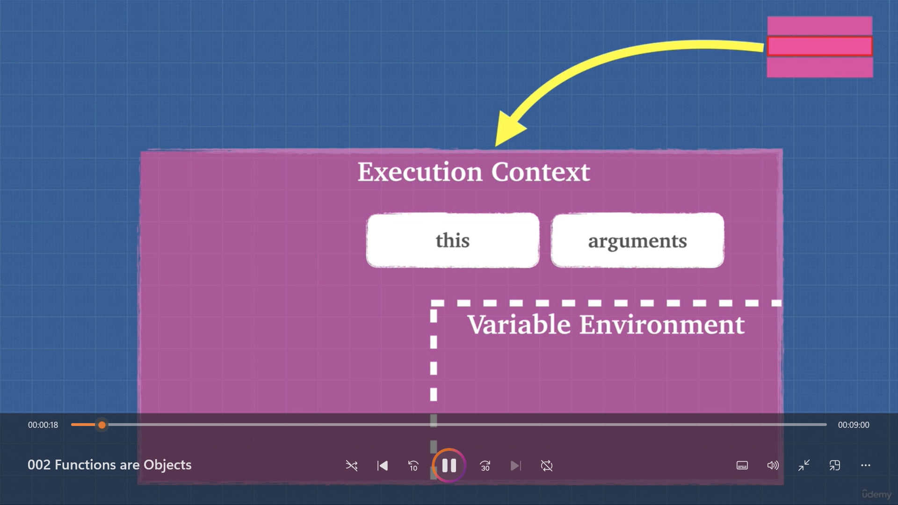
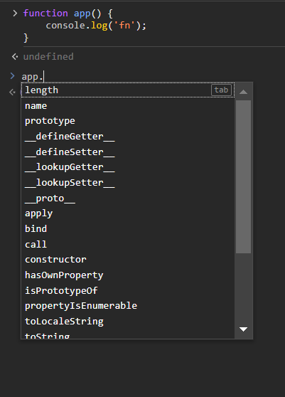
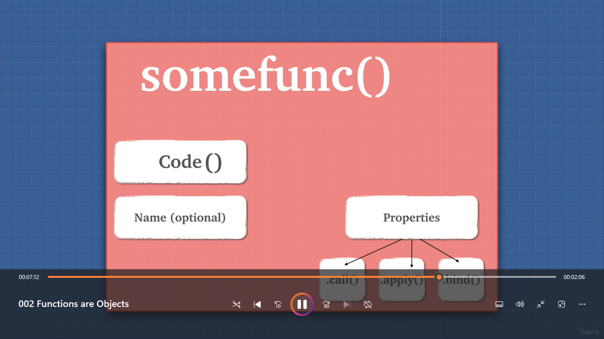
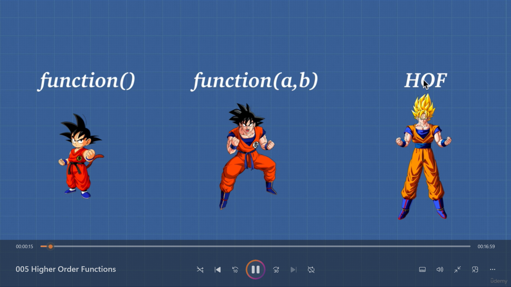

# 2 pillars of Js
1) Closure
2) Prototype

## functions in Js

**functions are special kind of javascript objects**
It has properties and methods 

## Functions are First class citizen in Js 
because: 
* we can assign a function to a variable or property
* we can pass a function to another function as a argument
* we can return a function from another function as a value

## Higher Order Functions In Js
