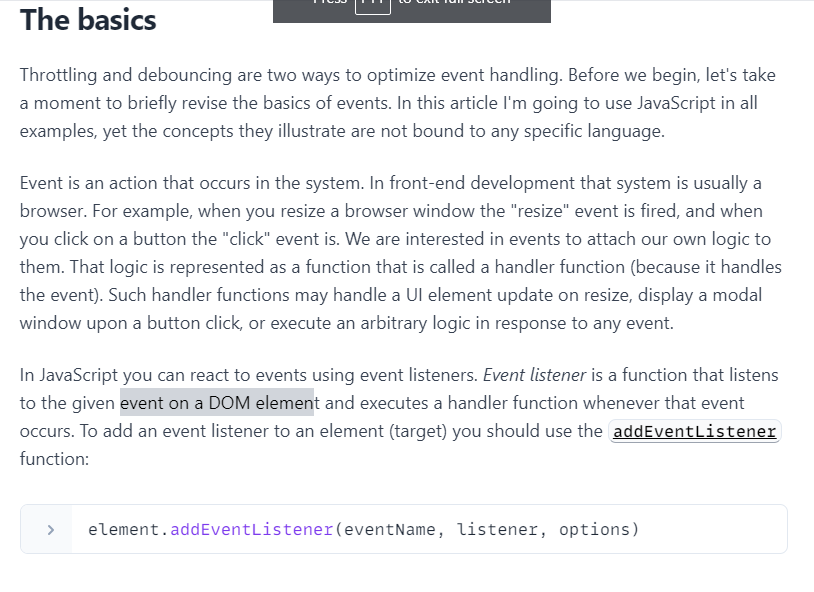
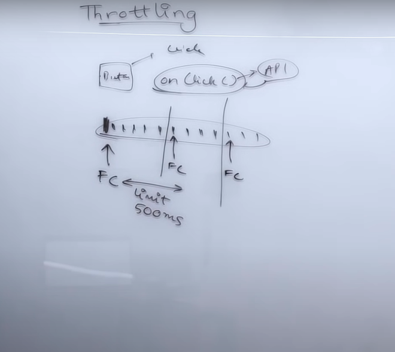
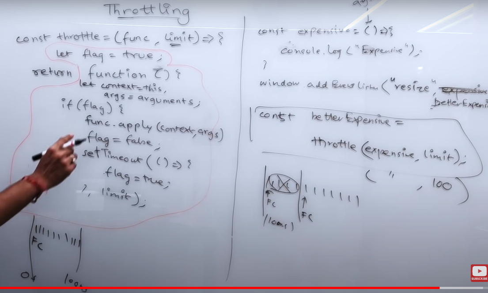
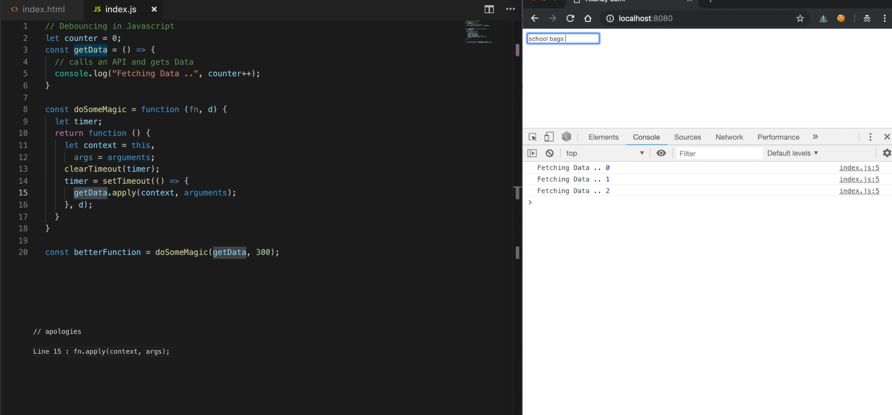
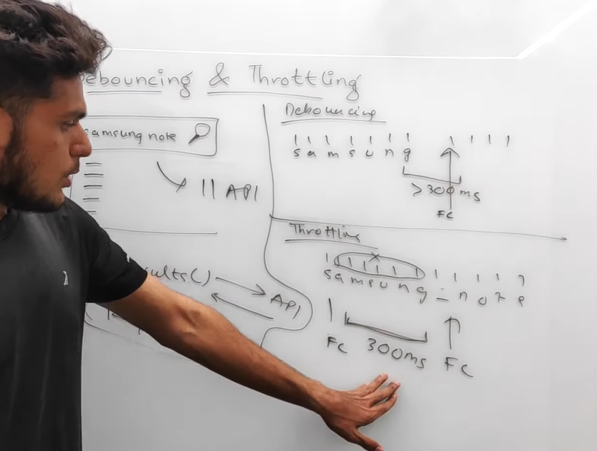

# Debounce vs Throttle

#### Note: Throttling and debouncing are two ways to optimize event handling

## By default, event listener executes with 1-1 ratio to the event call.

## Throttling

Throttle is a spring that throws balls: after a ball flies out, it needs some time to shrink back, so it cannot throw any more balls unless it's ready.

## When to use throttle?
Use throttling to consistently react to a frequent event.

This technique ensures consistent function execution within a given time interval. Since throttle is bound to a fixed time frame, the event listener should be ready to accept an intermediate state of the event.

## Debouncing

## Difference b/w Debouncing & Throttling
