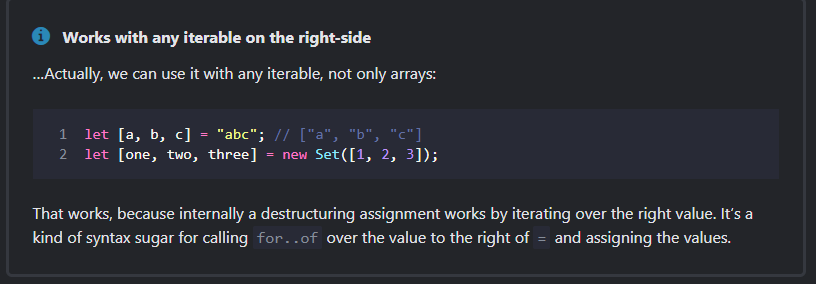

# Destructuring assignment

The two most used data structures in JavaScript are Object and Array.

Objects allow us to create a single entity that stores data items by key.
Arrays allow us to gather data items into an ordered list.
Although, when we pass those to a function, it may need not be an object/array as a whole. It may need individual pieces.

Destructuring assignment is a special syntax that allows us to “unpack” arrays or objects into a bunch of variables, as sometimes that’s more convenient.

## Array Destructuring

#### Tips

### Ignore elements using commas

<pre>
<code>
const fullName = ["Rahul", "Kumar", "Keshri"];

const [firstName, , lastName] = fullName;
console.log(firstName); // Rahul
console.log(lastName);  // Keshri

</code>
</pre>

### Tip 2

### Tip 3 ( Swap Values)
<pre>
<code>
let a = 10;
let b = 90;

[a,b] = [b,a];

console.log('A is', a); // 90
console.log('B is', b); // 10

</code>
</pre>

### Tip 4

### Tip 5

## Object Destructuring

The destructuring assignment also works with object

### Nested Destructuring
If an object or an array contain other nested objects and arrays, we can use more complex left-side patterns to extract deeper portions.

