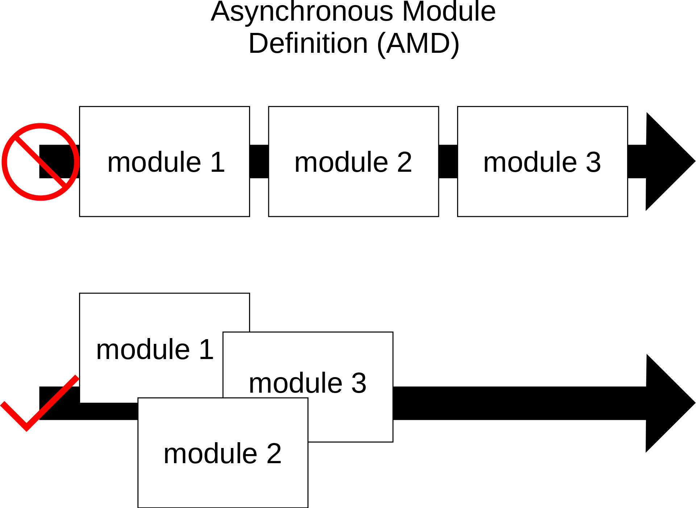
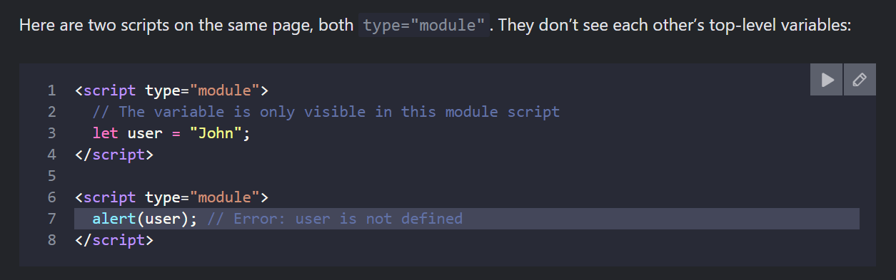
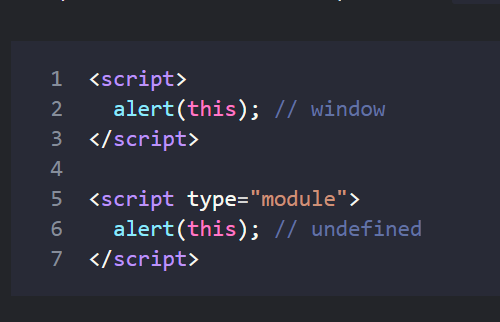
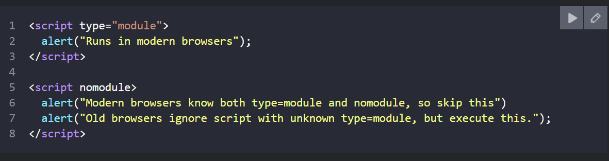

# Modules

As our application grows bigger, we want to split it into multiple files, so called “modules”. A module may contain a class or a library of functions for a specific purpose.

The language-level module system appeared in the standard in 2015 (ES6), gradually evolved since then, and is now supported by all major browsers and in Node.js.

## Some Modules
### AMD ( Asynchronous Module Definition)

Asynchronous module definition (AMD) is a specification for the programming language JavaScript. It defines an application programming interface (API) that defines code modules and their dependencies, and loads them asynchronously if desired.

### CommonJs

### UMD

## What is a module?

A module is just a file. One script is one module. As simple as that.

Modules can load each other and use special directives export and import to interchange functionality, call functions of one module from another one:

- <code>export</code> keyword labels variables and functions that should be accessible from outside the current module.
- <code>import</code> allows the import of functionality from other modules.

For instance, if we have a file sayHi.js exporting a function:

<pre>
<code>
// 📁 sayHi.js
export function sayHi(user) {
  alert(`Hello, ${user}!`);
}
</code>
</pre>

…Then another file may import and use it:

<pre>
<code>
// 📁 main.js
import {sayHi} from './sayHi.js';

alert(sayHi); // function...
sayHi('John'); // Hello, John!
</code>
</pre>

The import directive loads the module by path ./sayHi.js relative to the current file, and assigns exported function sayHi to the corresponding variable.

## Core module features

There are core features, valid both for browser and server-side JavaScript.

### Always “use strict”
Modules always work in strict mode. E.g. assigning to an undeclared variable will give an error.
<pre> <code>
< script type="module">
  a = 5; // error
< script/>
</code>
</pre>

### Module-level scope
Each module has its own top-level scope. In other words, top-level variables and functions from a module are not seen in other scripts.

In the browser, if we talk about HTML pages, independent top-level scope also exists for each 

### A Module code is evaluated only the first time when imported

If the same module is imported into multiple other modules, its code is executed only once, upon the first import. Then its exports are given to all further importers.

### In a module, “this” is undefined
In a module, top-level this is undefined.

Compare it to non-module scripts, where this is a global object:

## Browser specific features of a module
### Module scripts are deferred
### Async works on inline scripts
For non-module scripts, the async attribute only works on external scripts. Async scripts run immediately when ready, independently of other scripts or the HTML document.

For module scripts, it works on inline scripts as well.

### No “bare” modules allowed

In the browser, import must get either a relative or absolute URL. Modules without any path are called “bare” modules. Such modules are not allowed in import.

For instance, this import is invalid:
<pre> <code>
import {sayHi} from 'sayHi'; // Error, "bare" module
// the module must have a path, e.g. './sayHi.js' or wherever the module is
</code> </pre>
Certain environments, like Node.js or bundle tools allow bare modules, without any path, as they have their own ways for finding modules and hooks to fine-tune them. But browsers do not support bare modules yet.

### Compatibility, “nomodule”
Old browsers do not understand type="module". Scripts of an unknown type are just ignored. For them, it’s possible to provide a fallback using the nomodule attribute:

### Build tools