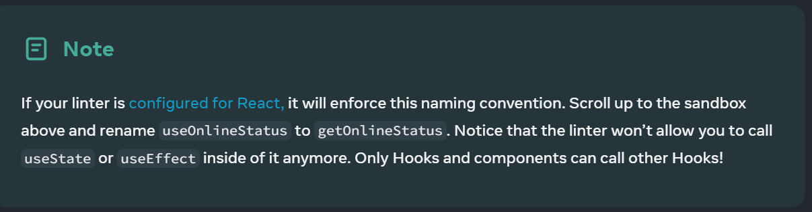

# 🧑‍💻Reusing Logic with Custom Hooks

## Rules
You must follow these naming conventions:

* ###### React component names must start with a capital letter, like StatusBar and SaveButton. React components also need to return something that React knows how to display, like a piece of JSX.
* ###### Hook names must start with use followed by a capital letter, like useState (built-in) or useOnlineStatus (custom, like earlier on the page). Hooks may return arbitrary values.

Custom Hooks let you share stateful logic but not state itself. Each call to a Hook is completely independent from every other call to the same Hook.