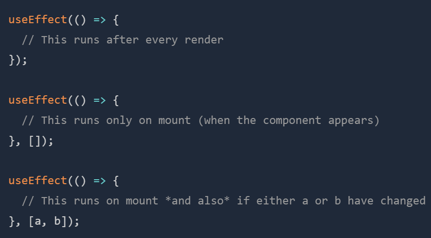

# useEffect
Certain components in React need to interact with things outside themselves. These things can be anything from querying data from a server to finding/changing the position of the component on the webpage or even sending some data to a server when necessary. This interaction with the outside world is called a **side-effect.**

