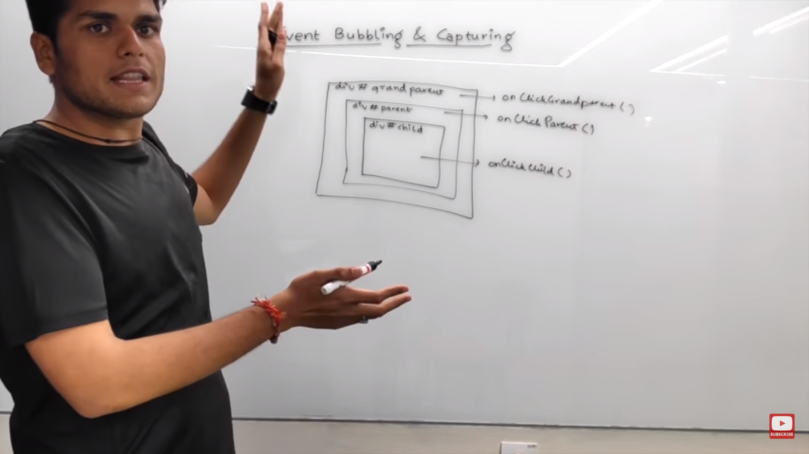
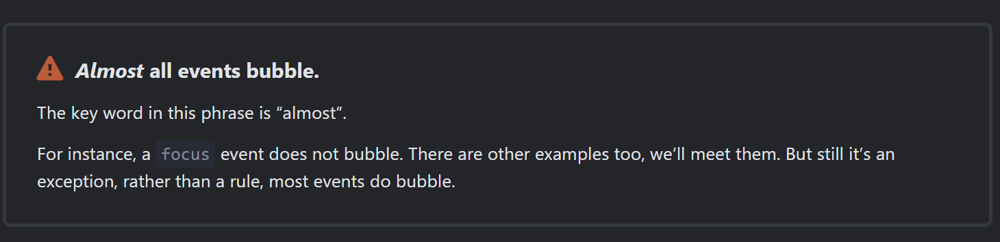
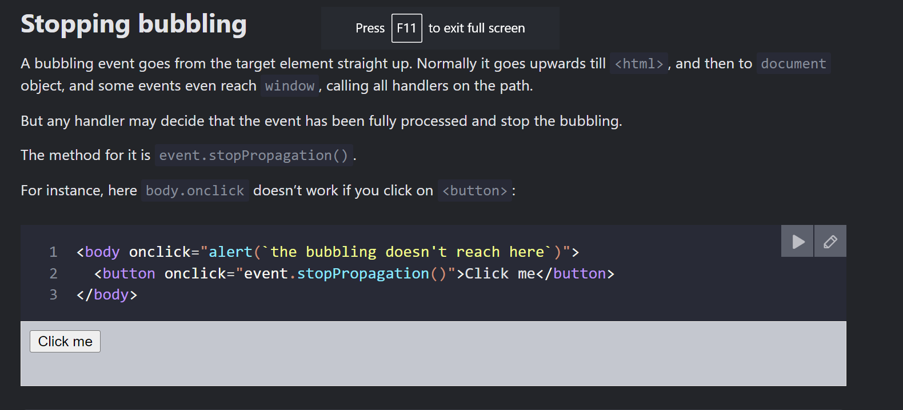
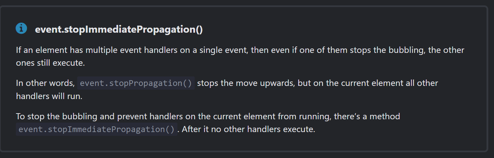
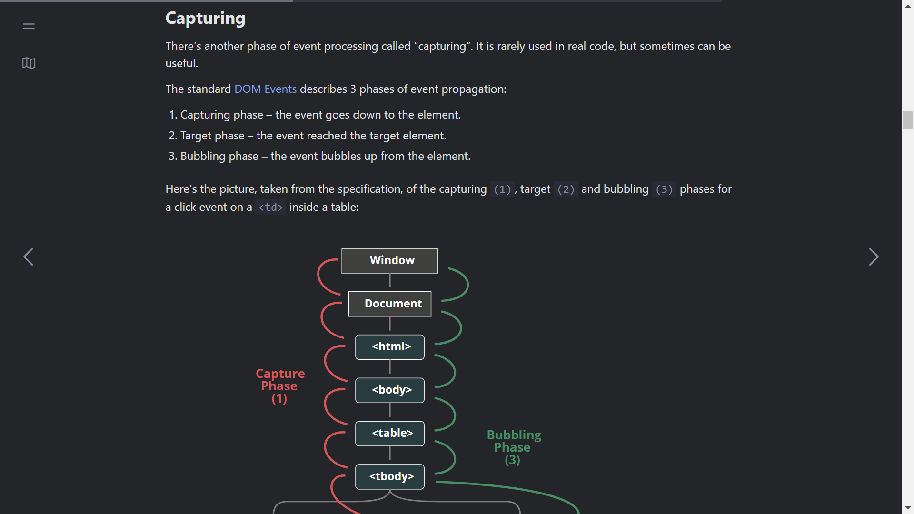
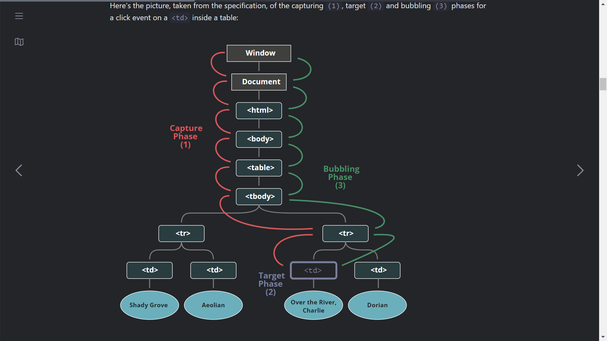

# Responding to Events

* Event 
* Event Handler

#### Event handler functions:

* Are usually defined inside your components.
* Have names that start with handle, followed by the name of the event.

By convention, it is common to name event handlers as handle followed by the event name. You’ll often see onClick={handleClick}, onMouseEnter={handleMouseEnter}, and so on.

#### Types of EventHandler
* Normal 
* Inline inside JSX

## Event Concepts
### Event Bubbling
The bubbling principle is simple.

When an event happens on an element, it first runs the handlers on it, then on its parent, then all the way up on other ancestors.

## Stopping Event Bubbling

#### special case

## Event Capturing

