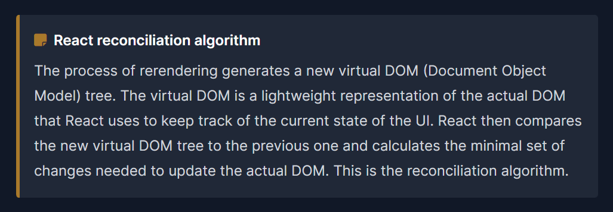
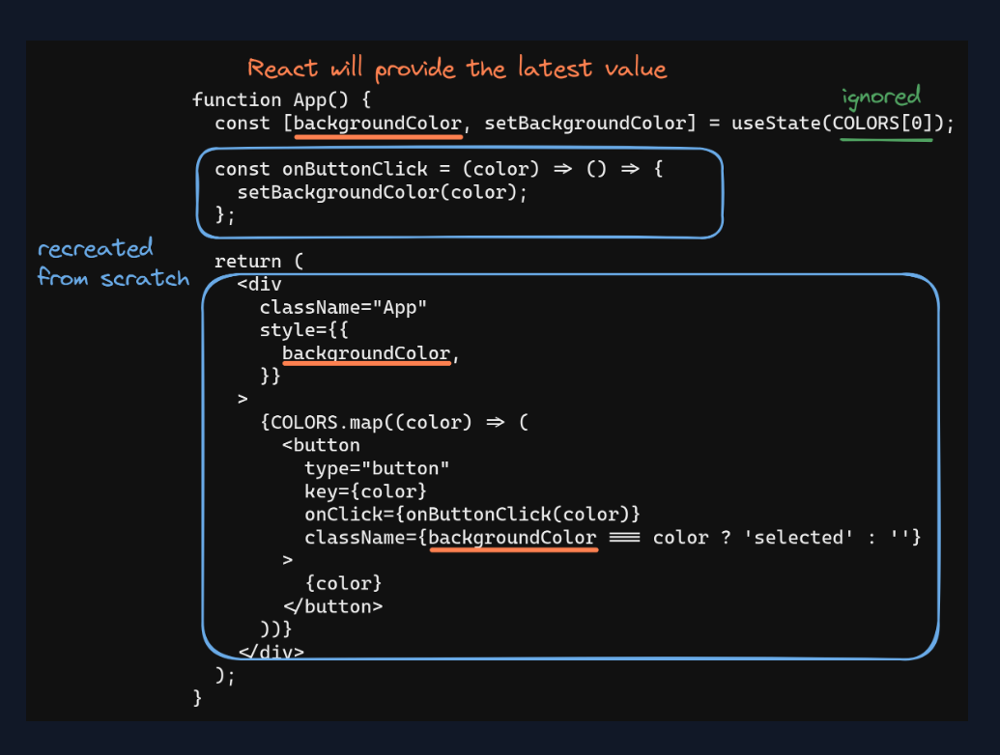

# React State
##### What is State?

We write components in React, A LOT of components, and many times we want them to undergo visual changes as a result of user or computer interactions. For this purpose, a component needs to “remember” things about itself. This is where state comes in. **State is a component’s memory.**

## The useState hook
The useState hook is a built-in hook in React that allows you to define state in a functional component. It takes an initial value as a parameter and returns an array with two elements that we can destructure to get:

* The current state value
* A function to update the state value
  
State definition with useState commonly follows this pattern:
<pre> <code>
const [stateValue, setStateValue] = useState(initialValue);
</code> </pre>

#### In React, when a component’s state or props change, the component is destroyed and recreated from scratch.

Yes, you heard that right: destroyed. This includes the variables, functions, and React nodes. The entire component is recreated but this time the latest state value will be returned from useState. This process is called **rerendering**. Rerendering is a key feature of React that enables it to efficiently update the user interface in response to changes in the underlying data.

## Rerendering  

## Hooks

Hooks are functions that let you use React features. All hooks are recognizable by the **use** prefix. For example, useState is a hook. We’ll use more of these as we get further into the course. For now, remember that hooks have rules that we need to abide by:

* Hooks can only be called from the top level of a functional component.
* Hooks can’t be called from inside loops or conditions.