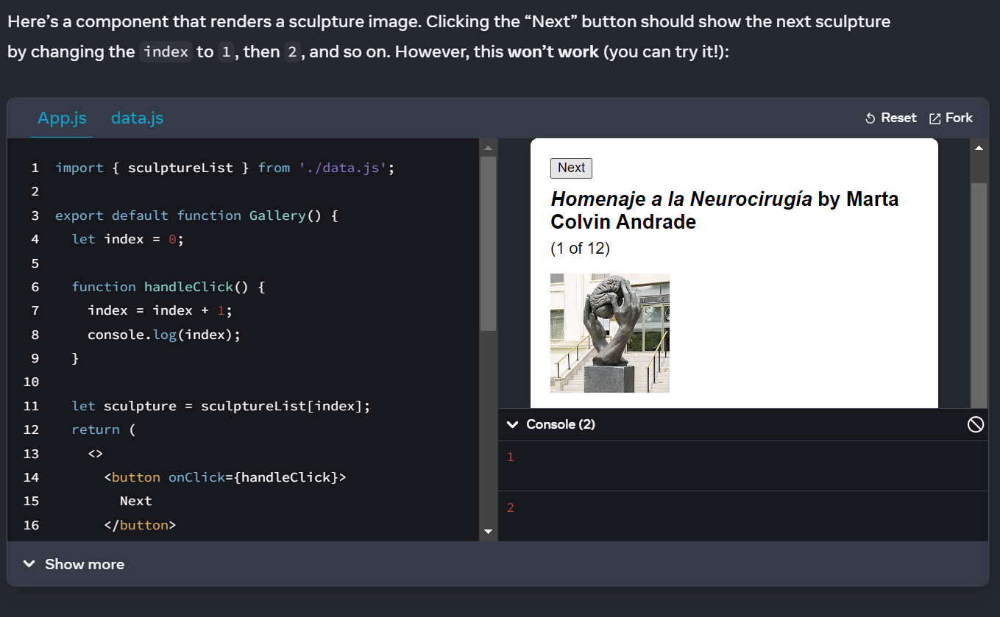

# State: A Component's Memory

## How does a state work behind the scene?
* Closure
* Array 

## When a regular variable isn’t enough

The handleClick event handler is updating a local variable, index. But two things prevent that change from being visible:

* Local variables don’t persist between renders. When React renders this component a second time, it renders it from scratch—it doesn’t consider any changes to the local variables.
* Changes to local variables won’t trigger renders. React doesn’t realize it needs to render the component again with the new data.

To update a component with new data, two things need to happen:

* Retain the data between renders.
* Trigger React to render the component with new data (re-rendering).