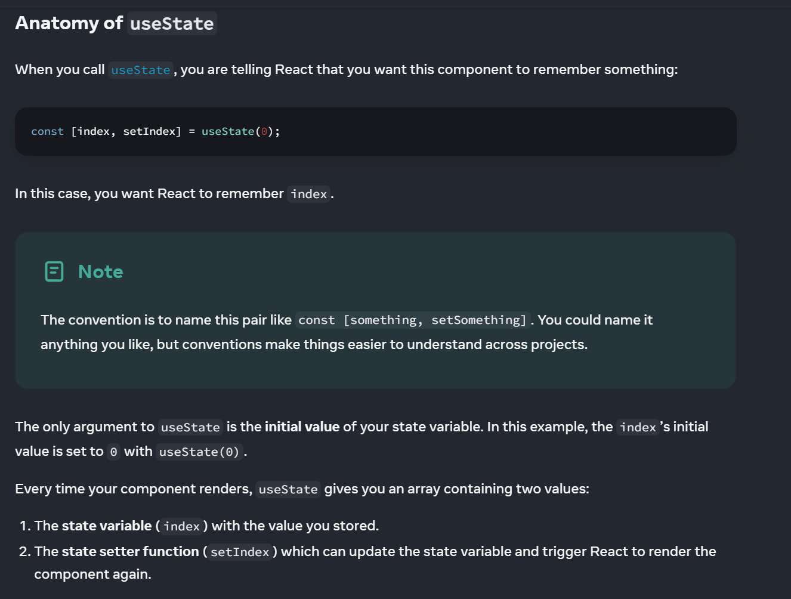
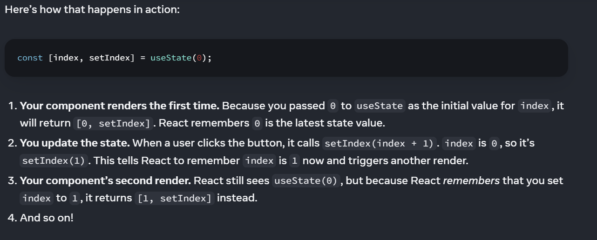

# State: A Component's Memory

## How does a hook work behind the scene?
* Closure
* Array 

## When a regular variable isn’t enough

The handleClick event handler is updating a local variable, index. But two things prevent that change from being visible:

* Local variables don’t persist between renders. When React renders this component a second time, it renders it from scratch—it doesn’t consider any changes to the local variables.
* Changes to local variables won’t trigger renders. React doesn’t realize it needs to render the component again with the new data.

To update a component with new data, two things need to happen:

* Retain the data between renders.
* Trigger React to render the component with new data (re-rendering).

## useState Hook 🪝

### State is isolated and private 
State is local to a component instance on the screen. In other words, if you render the same component twice, each copy will have completely isolated state! Changing one of them will not affect the other.