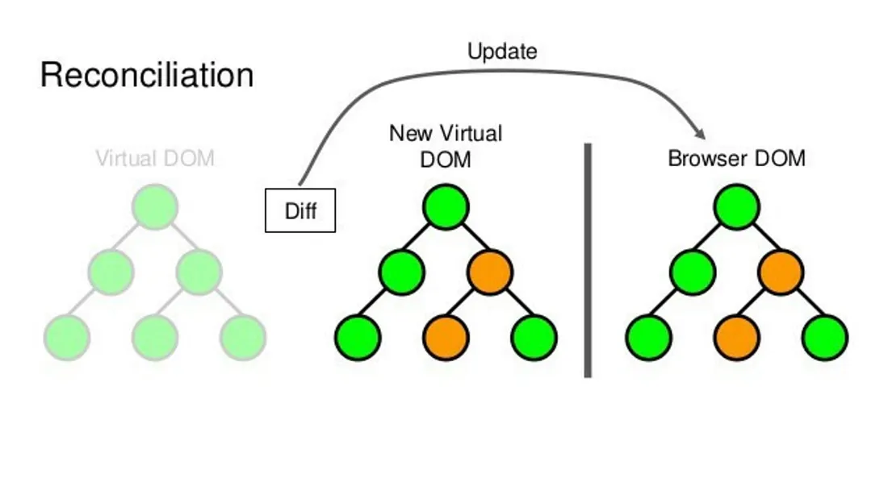

# React Reconciliation in React 18

## What is React Reconciliation?

React Reconciliation is the process by which React determines the changes made to the virtual DOM and applies those changes efficiently to the actual DOM. It ensures that the user interface remains synchronized with the underlying data, minimizing unnecessary updates and rendering only the necessary components.

In previous versions of React, the reconciliation algorithm, also known as “diffing” or “tree diffing,” compared the previous and current virtual DOM trees to identify differences and update the affected components accordingly. However, this approach had limitations, particularly when dealing with large and complex component hierarchies.

## Reconciliation in React 18.

The new reconciliation algorithm in React 18, known as “Concurrent React,” divides the reconciliation work into smaller units called “fibers” and prioritizes them based on their importance. This approach enables React to efficiently interrupt and resume the reconciliation process, prioritizing user interactions and other high-priority tasks.

## Key Concepts in React Reconciliation:
### 01 Fiber Reconciliation:

The reconciliation process in React 18 operates at the fiber level. A fiber represents a component and its corresponding work. By dividing the reconciliation work into smaller fibers, React can manage and prioritize them more efficiently.

### 02 Render Phase and Commit Phase:

The reconciliation process is divided into two main phases: the render phase and the commit phase. In the render phase, React traverses the component tree, creating or updating the fibers. It determines what components need to be rendered and builds a priority list based on the urgency of their updates.

In the commit phase, React applies the changes to the actual DOM. This phase is also divided into multiple priority levels, allowing React to prioritize critical updates and respond to user interactions without compromising performance.