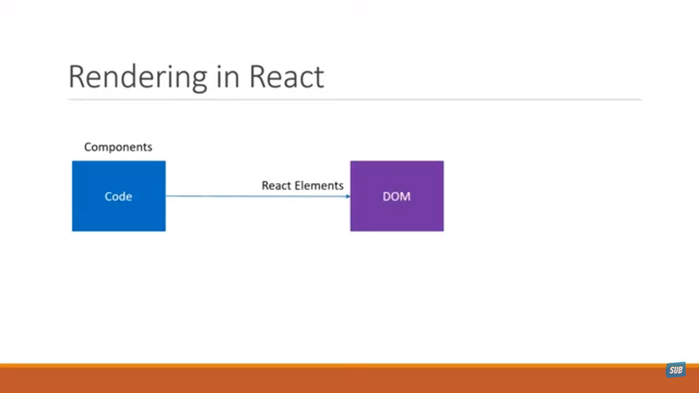
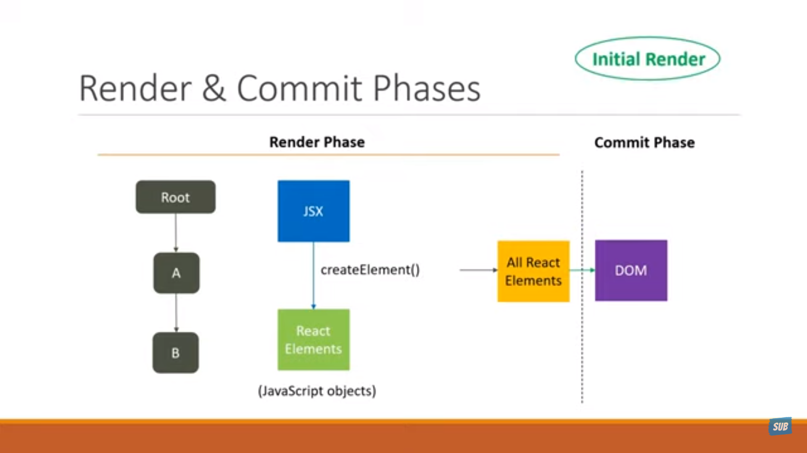
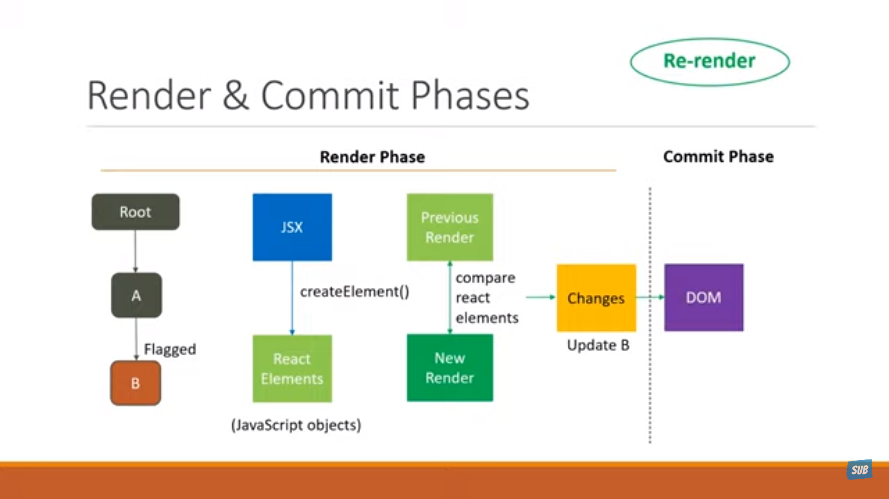
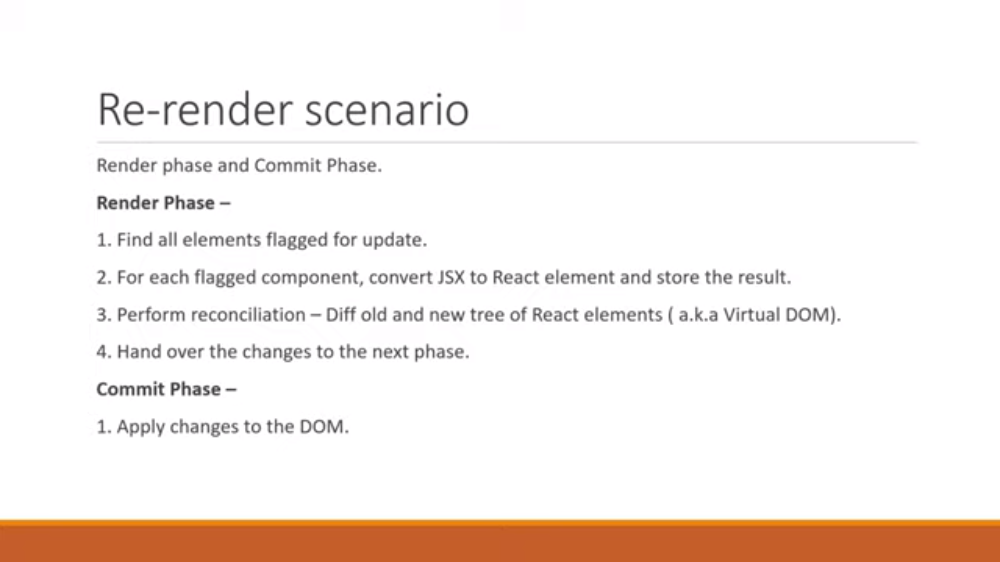
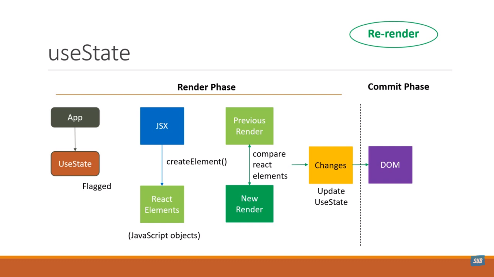
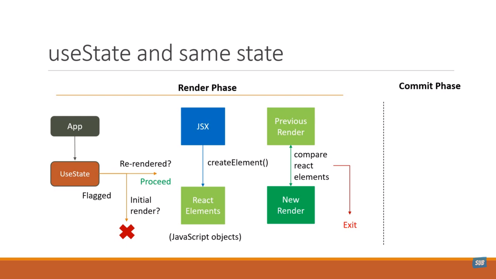
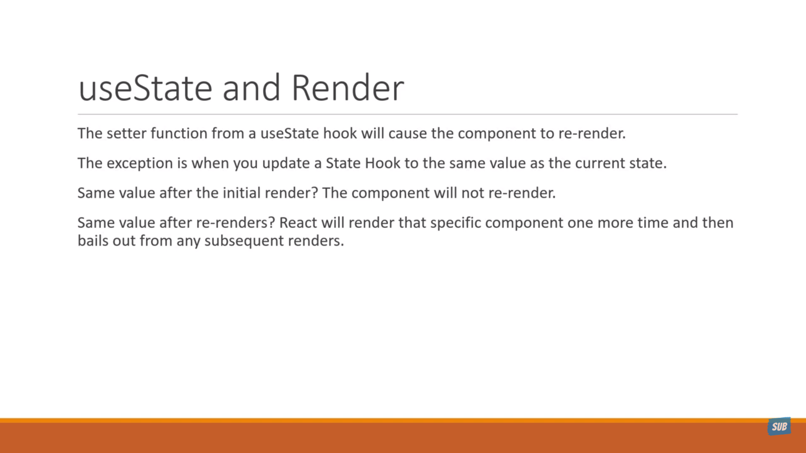

# Render & Commit

## Youtube Lecture

## Initial Render 

## Re-rendering

## Recap

## useState 

## useState with same State value

# React Docs

Imagine that your components are cooks in the kitchen, assembling tasty dishes from ingredients. In this scenario, React is the waiter who puts in requests from customers and brings them their orders. This process of requesting and serving UI has three steps:

* Triggering a render (delivering the guest’s order to the kitchen)
* Rendering the component (preparing the order in the kitchen)
* Committing to the DOM (placing the order on the table)

### Step 1: Trigger a render 
There are two reasons for a component to render:

* It’s the component’s initial render.
* The component’s (or one of its ancestors’) state has been updated.

### Step 2: React renders your components 
After you trigger a render, React calls your components to figure out what to display on screen. “Rendering” is React calling your components.

* On initial render, React will call the root component.
* For subsequent renders, React will call the function component whose state update triggered the render.

### Step 3: React commits changes to the DOM 
After rendering (calling) your components, React will modify the DOM.

* For the initial render, React will use the appendChild() DOM API to put all the DOM nodes it has created on screen.
* For re-renders, React will apply the minimal necessary operations (calculated while rendering!) to make the DOM match the latest rendering output.