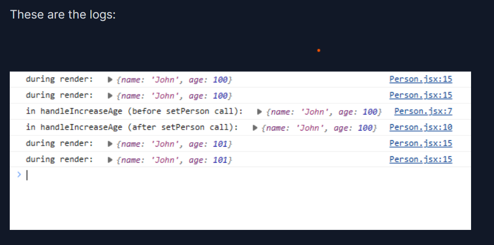

# Deep Dive In State

## State should not be mutated
Mutating state is a no-go area in React as it leads to unpredictable results. Primitives are already immutable, but if you are using reference type values i.e. arrays and objects, never mutate them. According to React documentation, we should treat state as if it was immutable. In order for us to change state, we should always use the setState function. Make sure to run the following example locally and see the difference for yourself.

#### Tip

## How state updates
State updates are **Asynchronous**. What this implies is whenever you call the setState function, React will apply the update in the next component render.

Remember, state variables aren’t reactive, the component is. This can be understood by the fact that calling <code>setState</code> re-renders the entire component instead of just changing the state variable on the fly.

#### output

## State updater functions
#### passing a callback to setState function

