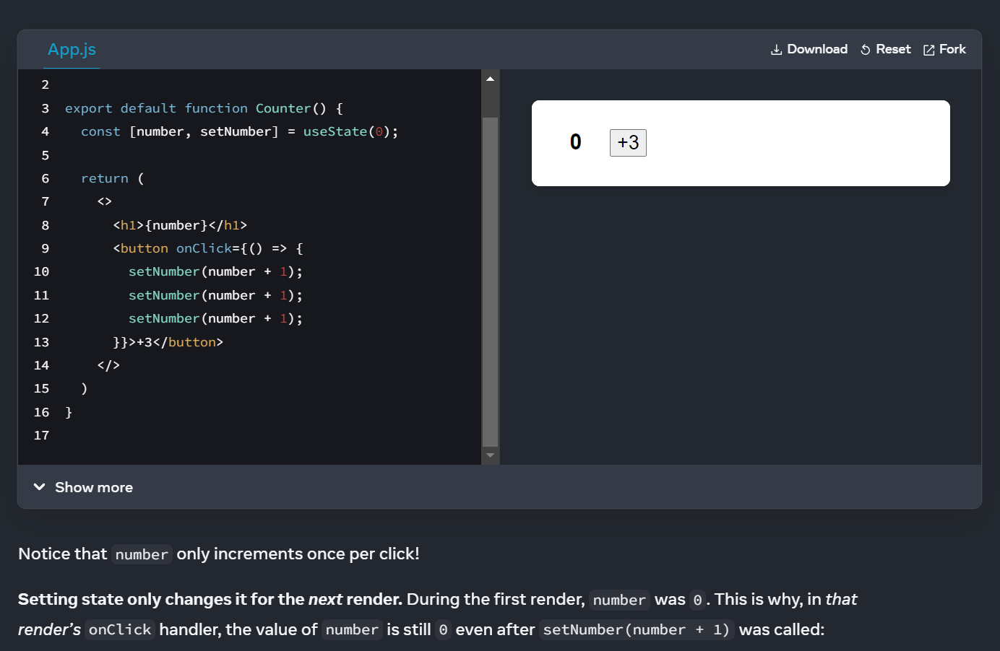

# State as Snapshot 

State variables might look like regular JavaScript variables that you can read and write to. However, state behaves more like a snapshot. Setting it does not change the state variable you already have, but instead triggers a re-render.

## Rendering takes a snapshot in time

As a component’s memory, state is not like a regular variable that disappears after your function returns. State actually “lives” in React itself—as if on a shelf!—outside of your function. When React calls your component, it gives you a snapshot of the state for that particular render. Your component returns a snapshot of the UI with a fresh set of props and event handlers in its JSX, all calculated using the state values from that render!

## State over time
A state variable’s value never changes within a render, even if its event handler’s code is asynchronous. Inside that render’s onClick, the value of number continues to be 0 even after setNumber(number + 5) was called. Its value was “fixed” when React “took the snapshot” of the UI by calling your component.

React keeps the state values “fixed” within one render’s event handlers. You don’t need to worry whether the state has changed while the code is running.

