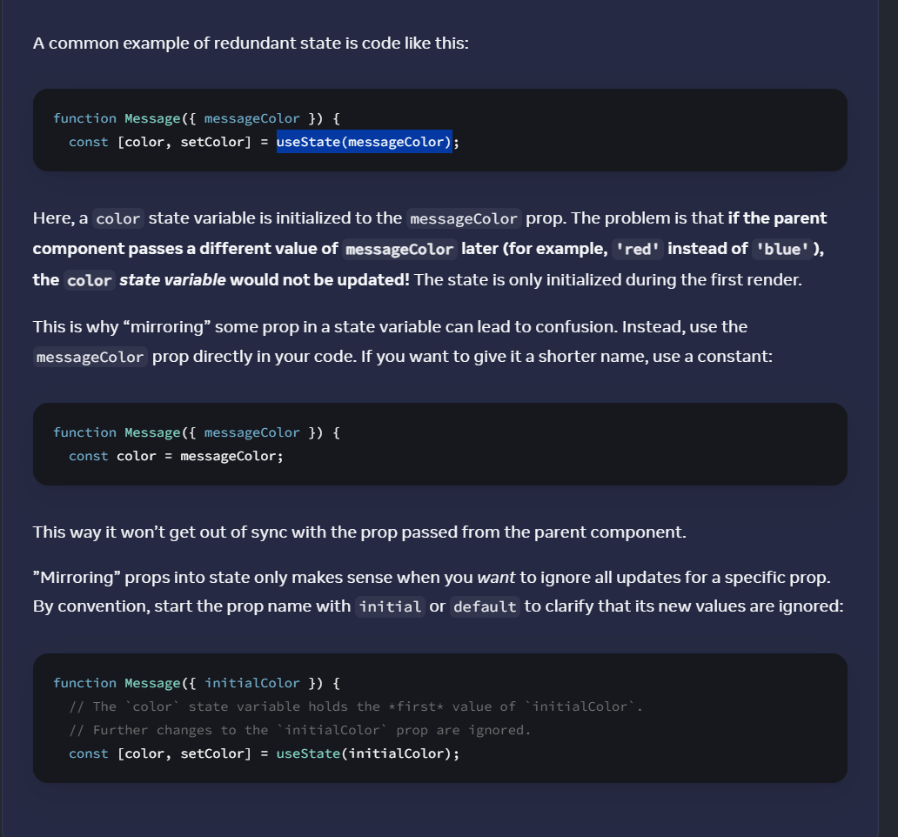

# Choosing the State Structure

## Principles for structuring state
## Group related state.
 If you always update two or more state variables at the same time, consider merging them into a single state variable.

## Avoid contradictions in state

## Avoid redundant state 
If you can calculate some information from the component’s props or its existing state variables during rendering, you should not put that information into that component’s state.

## Props Mirroring

## Avoid duplication in state 